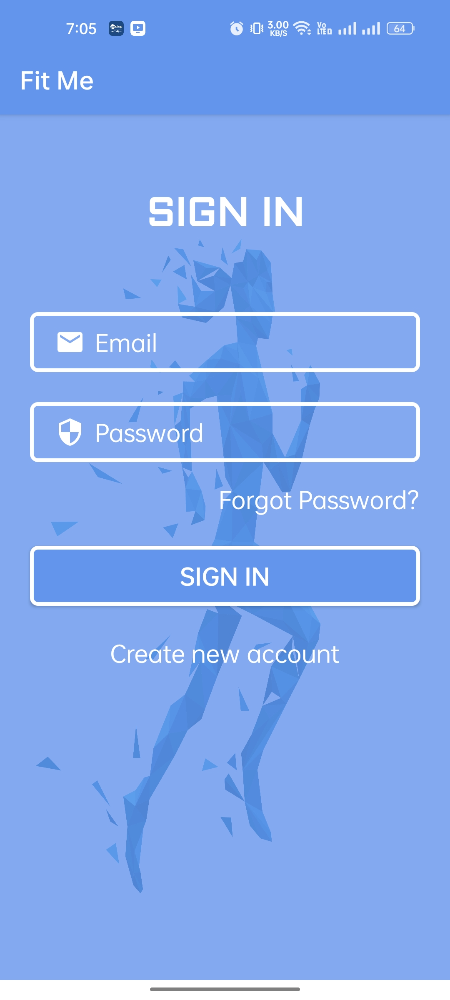
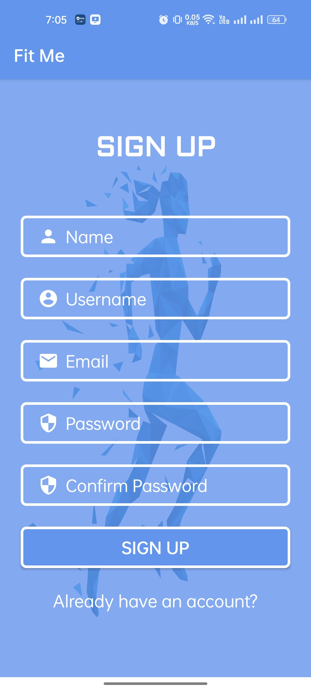
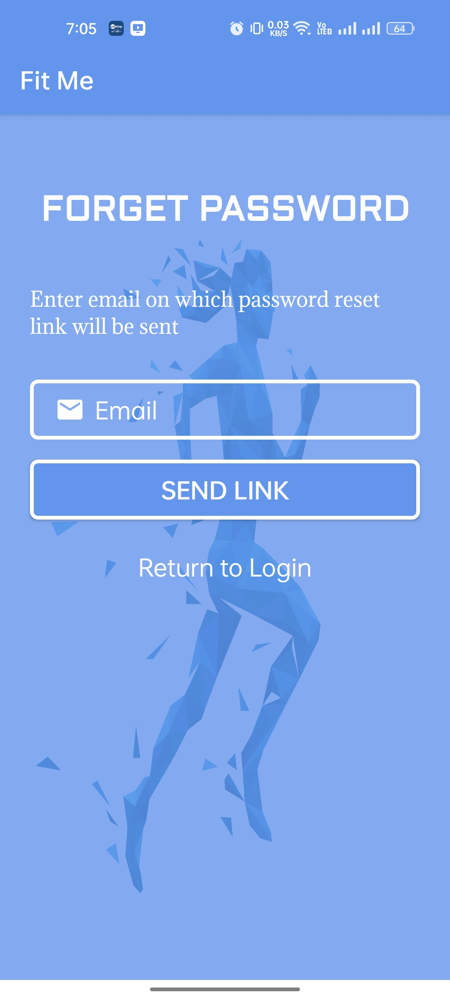
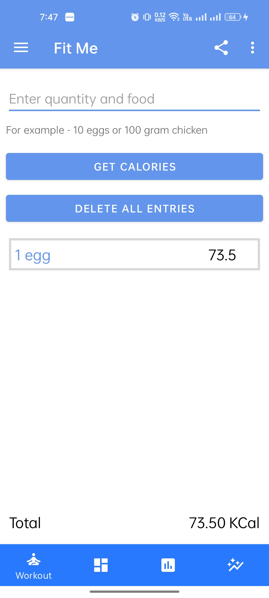
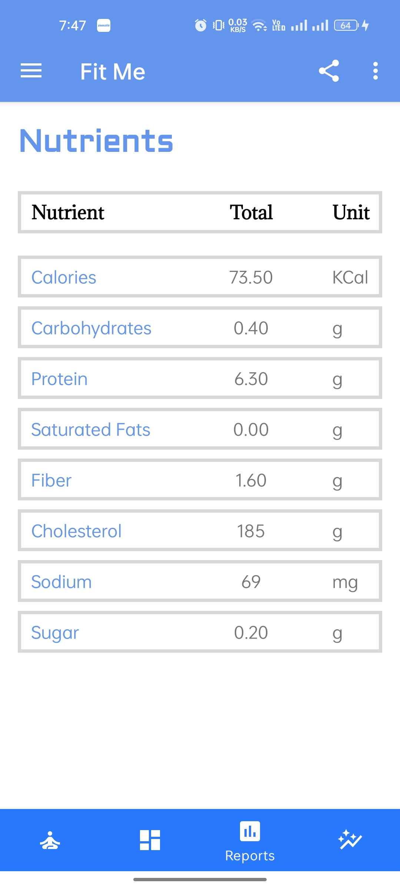
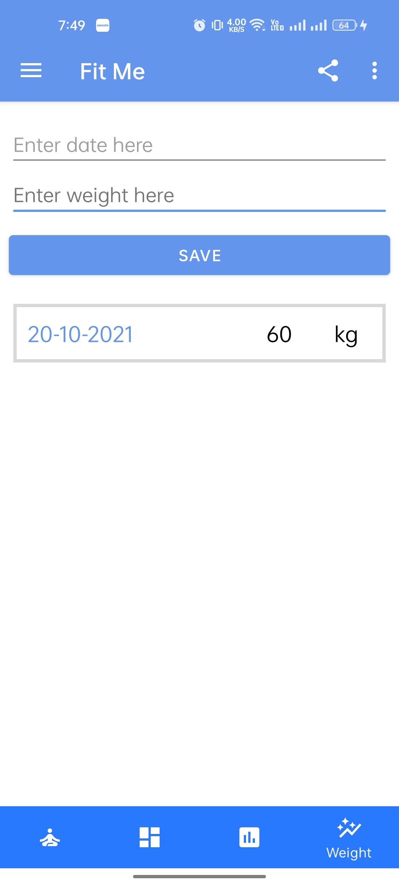
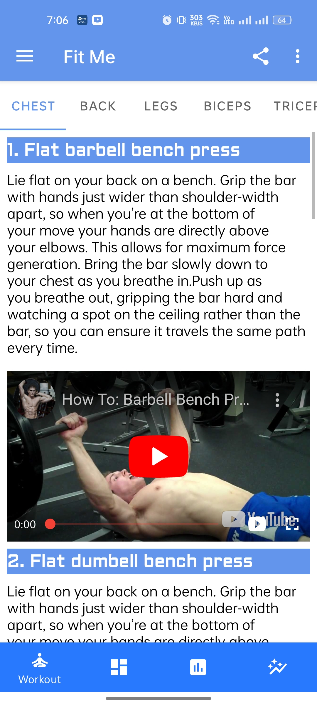
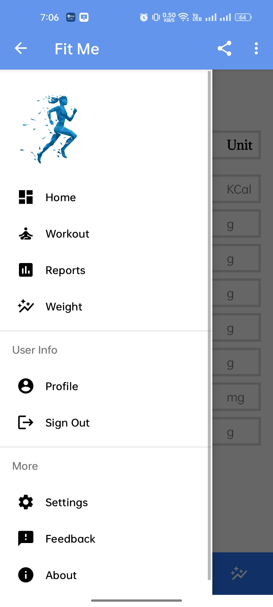
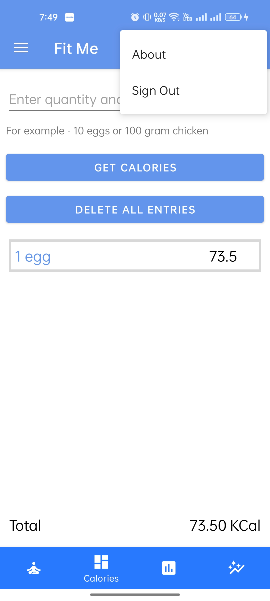
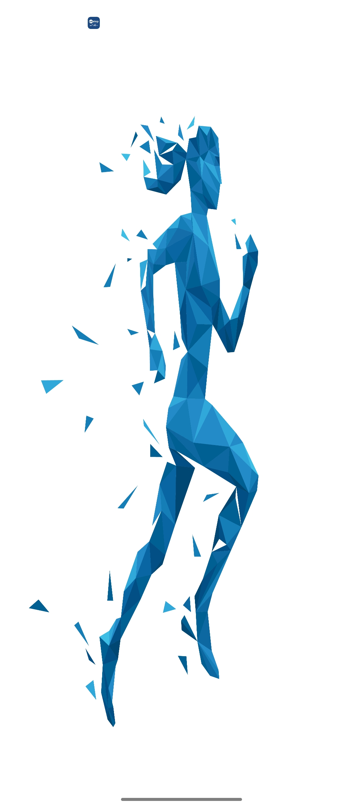

# Fit Me   
##### (Screenshots attached below)

## Description
**Fit Me** is an Android app developed for fitness enthusiasts and people under cretains medical condition to track their daily calorie intake as well as  macros and micros of the food they eat throughout the day. 

### Features -
- Users can see track their daily calorie intake from Indian foods which is not available on any other app.
- Users can check macros and micros of the food undertaken in Report section.
- Users can track their weight in Weight section.
- Users can learn different workout for different muscles by watching videos in Workout section.

## Android Architecture Components
- Firebase Auth
- Firestore
- MVVM Architecture
- ViewModel
- Retrofit

## About App
  
**Fit Me** app is divided into mainly 4 Sections - .

- **1. Dashboard** - Users can track their daily calorie intake in this section by making a query of food item undertaken with its quantity.
- **2. Reports** - Users can track their macro as well as micro nutrients in this section.
- **3. Workout** - Users can learn different workout for different muscles by watching videos in this section.
- **4. Weight** - Users can track their weight in this section.
  
  
||||
|:----------------------------------------:|:-----------------------------------------:|:-----------------------------------------: |
|  |  |  | 
|  |  |  |
|  |  |  |
|  |  |  |

## Architecture
This app uses [***MVVM (Model View View-Model)***](https://developer.android.com/jetpack/docs/guide#recommended-app-arch) architecture.

 

## Contact
If you need any help, you can connect with me.

Email - baibhavrajputt@gmail.com
